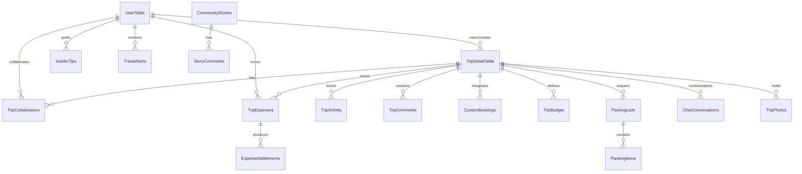

# ✈️ AI Trip Planner - Smart Travel Buddy

[](https://nextjs.org/)
[](https://react.dev/)
[](https://convex.dev/)
[](https://clerk.com/)
[](https://arcjet.com/)
[](https://groq.com/)
[](https://tailwindcss.com/)

An ultra-premium, full-featured AI-Powered Trip Planner and Travel Companion application. Designed to revolutionize how travelers plan, coordinate, budget, and share their journeys, it combines **Generative UI Chat** with a **real-time reactive backend**, advanced AI scheduling, and smart group utilities.

Developed using **Next.js 16 (App Router)**, **React 19**, **Convex**, **Clerk**, **Groq (Llama-3.3-70B)**, **Ola Maps**, **UploadThing**, and secured by **Arcjet**.

---

## 🌟 Key Highlights & Features

The platform offers **over 150+ integrated features** across multiple specialized modules:

### 1. 💬 Generative UI Conversational Planner
*   **Adaptive Chat Wizard:** A step-by-step interactive onboarding bot powered by **Groq Llama 3.3 70B** that asks one relevant question at a time.
*   **Generative UI Elements:** The chat dynamically renders custom UI components (budget cards, group select widgets, duration pickers) based on the current conversational context.
*   **Intelligent Token Bucket:** Employs **Arcjet rate limiting** (5 tokens per 24 hours, refilling dynamically) for free-tier users, with bypass rules for premium subscriptions.

### 2. 📅 Smart Booking-Aware Itinerary Editor
*   **Pre-Flight & Booking Scanning:** The AI automatically scans your existing flight, hotel, and restaurant bookings before generating an itinerary.
*   **Zero-Conflict Scheduling:** Builds the daily itinerary *around* your fixed flight arrivals, checkout times, and reservation slots.
*   **Interactive Editing Suite:** 
    *   ✏️ **Modify Activities:** Edit place names, details, addresses, ticket pricing, and durations.
    *   ➕ **Add Custom Plans:** Insert user-defined plans directly into any travel day.
    *   🗑️ **Quick Delete:** Remove plans instantly with reactive toast confirmations.
    *   📝 **Day Overview Editor:** Customize summary descriptions for each day.

### 3. 👥 Real-Time Multi-User Collaboration
*   **Live Reactive Syncing:** Powered by Convex's WebSocket-based sync, any changes to itineraries are instantly propagated to all online group members.
*   **Granular Collaborator Roles:** Invite travel partners as **Owners**, **Editors** (can edit itinerary/bookings), or **Viewers** (read-only access).
*   **Threaded Activity Comments:** Discuss specific plans or places right within the itinerary using parent-child threaded commenting.
*   **Live Activity Log:** Real-time logging of collaborative modifications (e.g., *"Anurag added a lunch spot"*, *"Vivek updated hotel info"*).

### 4. 💸 Multi-Currency Expense Splitter & Budget Manager
*   **Dynamic Visual Budgets:** Define trip-wide budget caps with breakdown targets for accommodation, food, transport, activities, shopping, and more.
*   **Advanced Split Logging:** Log expenses in any foreign currency. Split costs **equally**, by **custom percentages**, or log them as private personal expenses.
*   **Settlement Engine:** Automatically calculates *"who owes whom"* down to the cent, keeping clear records of pending and settled debts.
*   **Exchange Rate Cache:** Real-time multi-currency conversion utilizing an automated API-level exchange rate cache.

### 5. 🎒 Intelligent AI Packing Assistant
*   **Context-Based Packing Generation:** Generates tailored packing checklists based on destination climate, trip type (e.g., beach, skiing, city, backpacking), and duration.
*   **Group Item Assignment:** Delegate packing duties to specific group members to avoid packing redundant gear.
*   **Essential Alerts & Quantities:** Set item weights, quantities, essentiality badges, and check off items in real-time.

### 6. 🗺️ Location Intel & Local Insider Tips
*   **Ola Maps Web SDK:** Custom mapping integration for high-performance location rendering, marker plotting, and visual path planning.
*   **Verified Local Experts:** A community-driven system where locals can contribute hidden gems, safety advice, cultural etiquette, and money-saving tips.
*   **Helpful Voting & Bookmarks:** Vote on community tips and save them to your personal bookmark collection.

### 7. ⛅ Real-Time Weather Forecasts & Travel Alerts
*   **Weather Predictions:** Interactive current and daily weather predictions for your destination using OpenWeather Map API.
*   **Smart Threat Alerts:** Automated warning system alerting users about severe weather forecasts, impending budget breaches (>80% spent), and approaching document expiry dates (passports, visas).

### 8. 📸 Photo Galleries & AI Social Media Drafts
*   **Direct S3 Uploads:** Seamless high-resolution photo uploads using **UploadThing**.
*   **AI Social Post Generator:** Automatically writes creative captions and custom hashtags tailored for Instagram (stories, reels, posts), Twitter, Facebook, or WhatsApp based on your trip's best moments and images!

---

## 🛠️ Premium Technology Stack

| Layer | Technology | Purpose |
|---|---|---|
| **Framework** | **Next.js 16 (App Router)** | Hybrid Server/Client rendering, optimized layouts, API routes. |
| **Core UI** | **React 19** | Modern state lifecycle, Server Actions, concurrent rendering context. |
| **Styling** | **Tailwind CSS v4 + Radix UI** | Modern utility-first CSS engine combined with accessible primitive hooks. |
| **Backend & DB** | **Convex** | Real-time reactive document storage, serverless functions, change-streams. |
| **Auth** | **Clerk** | Seamless OAuth (Google, GitHub, etc.), JWT session validation, secure user routing. |
| **AI Integration**| **Groq (Llama-3.3-70B-Versatile)**| High-performance conversational responses, complex scheduling, structured JSON schemas. |
| **Security** | **Arcjet** | Token-bucket rate limiting, bot protection, serverless endpoint security shields. |
| **Uploads** | **UploadThing** | Fast, zero-config secure direct-to-S3 asset uploading. |
| **Maps** | **Ola Maps Web SDK** | Dynamic geolocation picking, map visualization, route displays. |
| **APIs** | **OpenWeather & Currency API** | Contextual live updates for destination weather and budget conversions. |

---

## 💾 Database Architecture (Convex Schema)

Our database schema is highly optimized for fast reactive queries and low latency. The tables and relationships are defined below:



### Key Entities
*   **`UserTable`:** Holds user profiles, avatars, and premium subscription details.
*   **`TripDetailTable`:** Master record for trips, including generated plan JSONs, sharing metadata, and cloning counts.
*   **`TripCollaborators`:** Bridges trips and users with role configurations (`owner`, `editor`, `viewer`).
*   **`CustomBookings`:** Stores flights, accommodations, reservations, and events with deep parameters (departure gates, confirmation numbers, check-in schedules) used to mold the final AI plans.
*   **`TripExpenses` & `ExpenseSettlements`:** Handles currency codes, split arrangements, custom weights, receipt attachment URLs, and payments pending settlement.
*   **`InsiderTips` & `VerifiedLocals`:** Governs crowdsourced regional guidelines, tags, verification pathways, and bookmark tallies.
*   **`TravelAlerts`:** Manages severity warnings (`info`, `warning`, `critical`) spanning weather spikes, budget overruns, and document deadlines.
*   **`PackingLists` & `PackingItems`:** Oversees templates (beach, camping, business, etc.), item states (`isEssential`, `isPacked`), weights, and assignments.

---

## 🚀 Local Development Setup

Follow these steps to run the complete reactive stack locally:

### 1. Clone & Install Dependencies
```bash
git clone https://github.com/ANURAGVIVEK0919/ai-trip-buddy.git
cd ai-trip-buddy
npm install
```

### 2. Configure Convex
Initialize your Convex backend environment:
```bash
npx convex dev
```
*This command will prompt you to log into Convex, create a new project, and automatically generate a `.env.local` file with your database variables.*

### 3. Add Environment Variables
Create a `.env.local` file in the root of the project and populate it with your development keys:

```env
# Convex Backend (Auto-filled by 'npx convex dev')
CONVEX_DEPLOYMENT=dev:your-project-name
NEXT_PUBLIC_CONVEX_URL=https://your-project.convex.cloud

# Clerk Authentication (dashboard.clerk.com)
NEXT_PUBLIC_CLERK_PUBLISHABLE_KEY=pk_test_...
CLERK_SECRET_KEY=sk_test_...
NEXT_PUBLIC_CLERK_SIGN_IN_URL=/sign-in
NEXT_PUBLIC_CLERK_SIGN_UP_URL=/sign-up
NEXT_PUBLIC_CLERK_SIGN_IN_FALLBACK_REDIRECT_URL=/
NEXT_PUBLIC_CLERK_SIGN_UP_FALLBACK_REDIRECT_URL=/

# UploadThing Credentials (uploadthing.com)
UPLOADTHING_SECRET=sk_live_...
UPLOADTHING_APP_ID=your_app_id

# AI & Third-Party APIs
GROQ_API_KEY=gsk_...
OLA_MAPS_API_KEY=your_ola_maps_key
OPENWEATHER_API_KEY=your_openweather_key
CURRENCY_API_KEY=your_currency_key

# Arcjet Security Site Key (app.arcjet.com)
ARCJET_KEY=ajkey_...
```

### 4. Run Development Server
Start the frontend dev server:
```bash
npm run dev
```
Open [http://localhost:3000](http://localhost:3000) with your browser to experience your new trip companion!

---

## ⛵ Production Deployment

Refer to [VERCEL_DEPLOYMENT_GUIDE.md](file:///e:/ai-trip-planner/VERCEL_DEPLOYMENT_GUIDE.md) and [QUICK_DEPLOY.md](file:///e:/ai-trip-planner/QUICK_DEPLOY.md) for full production deployment checklists.

### Summarized Flow:
1.  **Convex Live Build:** Deploy your Convex schema and mutations to production using `npx convex deploy`. Note down the production database URL.
2.  **Clerk Live Configuration:** Switch your Clerk app dashboard to Production mode. Register your production Vercel domain under "Domains & Allowed Origins".
3.  **Vercel Portal:**
    *   Import your GitHub repository.
    *   Inject all environment keys. Make sure to update Clerk, Convex, and UploadThing credentials to use production keys.
    *   Deploy!
4.  **CORS & Redirect Settings:** Update UploadThing CORS settings, Clerk production domain URLs, and Arcjet dashboards to authorize your new live domain.

---

## 🔒 Security & Performance Features
*   **Arcjet Web Shield:** Enforces deep token bucket limit rules protecting expensive LLM backend endpoints from abusive API spam.
*   **Intelligent Forecast Caching:** The weather forecast schema preserves target snapshots with timestamps, only pulling fresh payloads from OpenWeather when existing logs exceed active validation thresholds.
*   **Currency Cache:** Mitigates external request lags by caching global currency matrices in Convex and indexing queries dynamically by base currency.

---

*Made with ❤️ for global travelers.*
