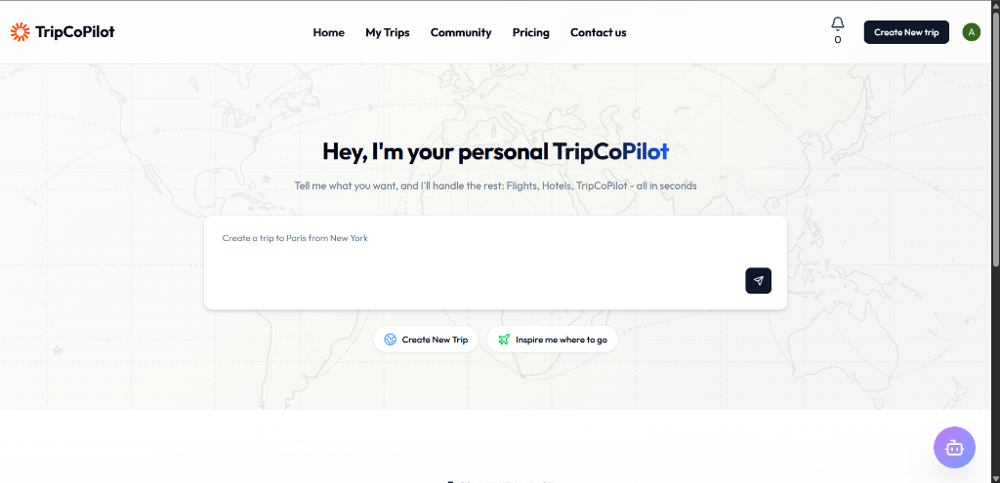
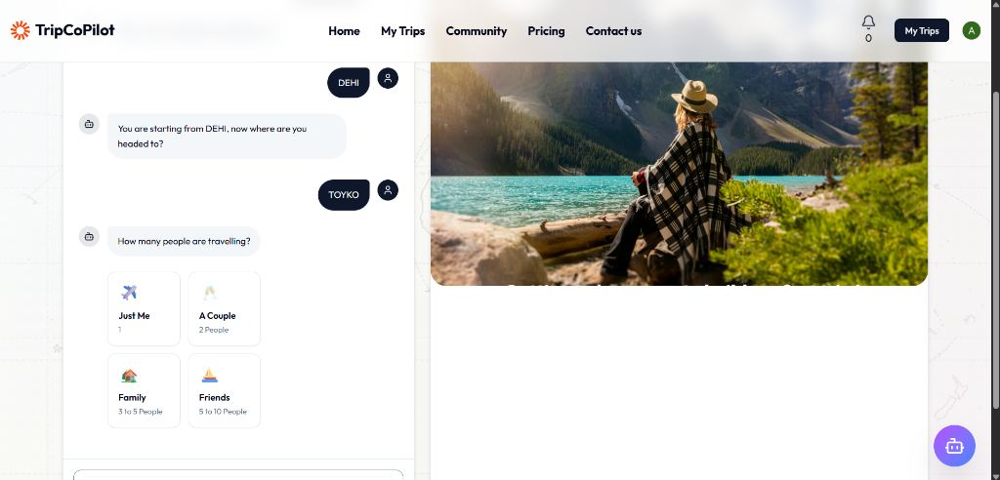
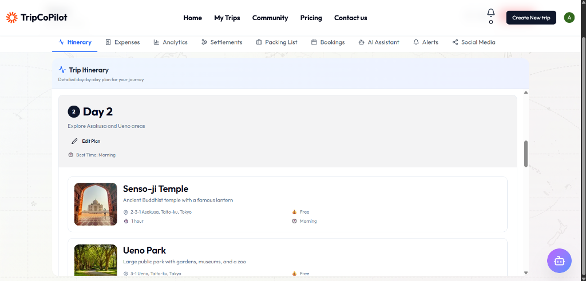
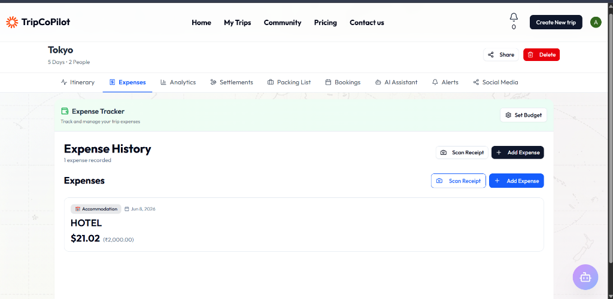
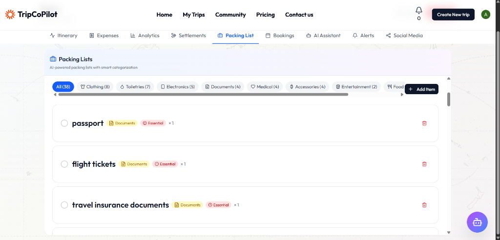
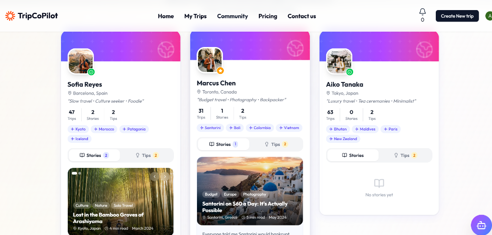
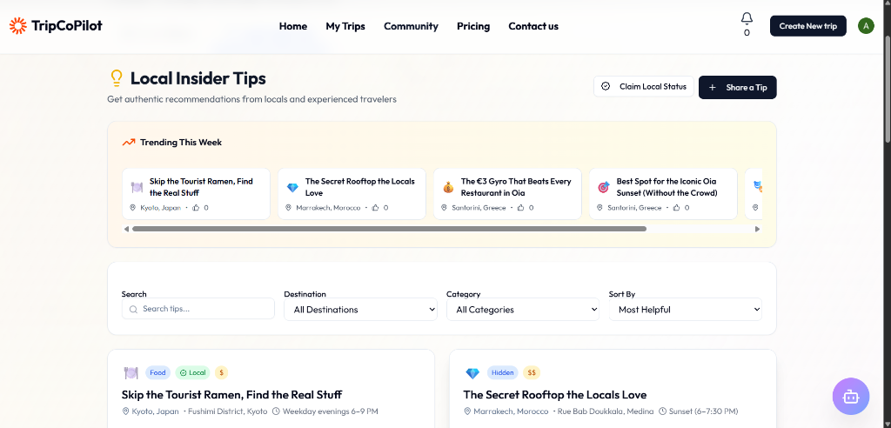

# ✈️ TripCoPilot — Smart Travel Buddy

**TripCoPilot** is a next-generation, real-time collaborative travel companion application designed to revolutionize how travelers plan, coordinate, budget, and experience their journeys. 

By combining an **AI-powered Generative UI Chat** with a **real-time reactive backend**, advanced conflict-aware scheduling, and group utility modules, the app turns the chaotic, fragmented process of trip planning into a seamless, interactive, and fun experience.

### 🌟 The Core Vision
Instead of filling out boring, static forms, travelers engage with an intelligent **AI Chatbot Wizard** that acts as a seasoned local guide. As you chat, the assistant dynamically renders rich, interactive components (budget charts, group selectors, hotel option cards, live weather forecasts) directly in your message feed. 

Under the hood, every adjustment—whether tweaking the day-by-day itinerary, uploading a receipt, or checking off a packing item—is powered by a reactive database. This ensures that changes sync instantly across every collaborator's screen in real-time, keeping your travel group in perfect harmony.

---

## 💡 What Problem Does It Solve?

Traditional trip planning is fragmented and chaotic:
- **Scattered Information**: Group chats, spreadsheets, emails, and notes are scattered across different platforms.
- **Collaboration Conflicts**: Getting multiple people to agree on destinations, schedules, and hotels causes confusion, and changes made by one person are not instantly visible to others.
- **Budgeting & Expense Tracking**: Logging expenses, splitting costs, and settling debts within a group is tedious and error-prone.
- **Packing & Preparedness**: Forgetting essential items due to lack of a structured packing list, or not knowing local weather conditions.
- **Fragmented Travel Knowledge**: Travelers rely on fragmented, generic blogs for local recommendations, finding it hard to get trusted advice. TripCoPilot hosts a centralized community knowledge base of authentic experiences and local insider tips.

**TripCoPilot** solves these issues by centralizing all travel planning utilities into a single, real-time reactive workspace with a conversational AI interface.

---

## 🛠️ Tech Stack & Why

Here are the core technologies used in TripCoPilot and why they were chosen:

| Component | Technology | Rationale (Why) |
| :--- | :--- | :--- |
| **Frontend Framework** | **Next.js 16 (App Router)** | High-speed server-side rendering, layout optimization, and simplified API routing. |
| **UI Engine** | **React 19 & Radix UI** | Concurrent rendering, modern state lifecycles, and accessible primitive components for smooth animations. |
| **Reactive Database** | **Convex DB** | Reactive real-time document storage using WebSocket architecture. Chosen because trip planning is collaborative, and Convex enables instant, real-time UI synchronization across all users without managing complex web sockets. |
| **Authentication** | **Clerk** | Secure social login flows, session management, and role-based route guards. |
| **AI Processing** | **Groq (Llama-3.3-70B)** | Blazing-fast natural language parsing, scheduling intelligence, and structured JSON generation. |
| **Security Shield** | **Arcjet** | Token-bucket rate-limiting, SQL injection protection, and API endpoint security to prevent LLM abuse. |
| **Asset Storage** | **UploadThing (S3)** | High-speed secure direct-to-S3 uploads for trip memories and receipts. |
| **Map Rendering** | **Ola Maps Web SDK** | Dynamic route plotting, visual marker tracking, and location autocomplete. |

---

## ✨ Features

- **Conversational AI Wizard**: An interactive chat interface that engages in a dialogue to help build your trip plan instead of boring static forms.
- **Conflict-Aware Itinerary Planner**: Schedules activities automatically, prioritizing fixed bookings (like flights/hotels) first and avoiding conflicts.
- **Real-Time Group Collaboration**: Invite group members as Owners, Editors, or Viewers. Every edit is synced in real-time.
- **Smart Expense Splitter & Budget Manager**: Log expenses in any currency and let the app's settlement engine calculate optimal repayments.
- **Weather & AI Packing Lists**: Tailored checklists based on destination climate, trip category, and duration, alongside current weather alerts.
- **Traveler Community Spotlight**: Share your travel stories with multiple high-quality photos, like, comment, and engage with other travelers' experiences.
- **Local Insider Tips**: Share and discover verified local tips, food recommendations, and budget hacks filtered by category and destination.

---

## 📸 Visual Walkthrough

### 1. Landing Page & Trip Creator
The entrance to the application allows you to search, view trip inspirations, and trigger the trip creator.

### 2. Conversational AI Chatbot
Engage with the AI assistant to dynamically build and customize your trip in real-time.

### 3. Interactive Itinerary
A comprehensive, detailed day-by-day plan of your journey, displaying activity routes, durations, and details.

### 4. Expense Tracker
Easily log transactions, attach receipts, manage your budget, and track splits across travel companions.

### 5. AI-Powered Packing Checklist
Get categorized smart packing suggestions tailored to your trip destination and duration.

### 6. Community - Featured Travelers
Spotlight and connect with active community members, showing their travel milestones, stats, and shared experiences.

### 7. Community - Local Insider Tips
Browse and share authentic local recommendations, hidden gems, and travel hacks from experienced locals.

