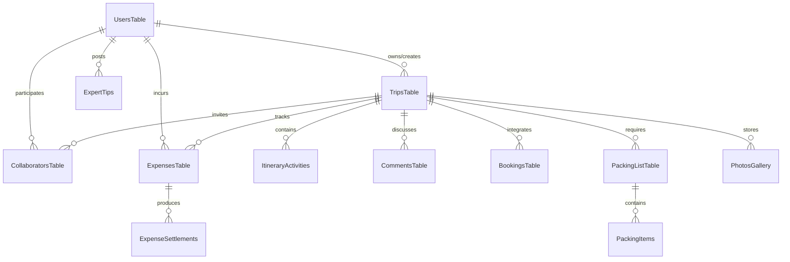

# ✈️ TripCoPilot — Smart Travel Buddy

[](https://nextjs.org/)
[](https://react.dev/)
[](https://convex.dev/)
[](https://clerk.com/)
[](https://arcjet.com/)
[](https://groq.com/)

**TripCoPilot (Smart Travel Buddy)** is a next-generation, collaborative travel planning application designed to revolutionize how travelers plan, coordinate, budget, and experience their journeys. 

By combining an **AI-powered Generative UI Chat** with a **real-time reactive backend**, advanced conflict-aware scheduling, and smart group utility modules, the app turns chaotic trip planning into a seamless, fun, and interactive experience.

---

## 🌟 Core Pillars of the App

### 1. 💬 Conversational AI & Generative UI
*   **Adaptive Chat Wizard**: Powered by **Groq Llama 3.3 70B**, the chatbot acts as a seasoned local guide. Instead of long static forms, it engages in an interactive conversation, asking context-specific questions.
*   **Generative UI Cards**: The chat dynamically renders rich custom interactive elements (budget charts, group selectors, hotel option cards) directly in the message feed based on the conversation flow.
*   **Arcjet Intelligent Shield**: Employs real-time rate limiting (Token Bucket) on LLM routes to prevent abuse, keeping the API usage efficient and secure.

### 2. 📅 Conflict-Free Itinerary Editor
*   **Booking Scanner**: Before drafting plans, the AI scans flight arrivals, hotel check-ins, and reservations.
*   **Conflict-Aware Scheduling**: It automatically locks in your fixed bookings first and schedules flexible leisure activities around them without conflicts.
*   **Full Editing Control**: Add, delete, and rearrange activities in real-time. Update pricing, ticket details, durations, and addresses on the fly with live preview.

### 3. 👥 Real-Time Collaboration & Social Sync
*   **Instant Reactive Updates**: Powered by **Convex DB**'s WebSocket architecture. If one traveler adjusts a plan, changes sync instantly on everyone's screen.
*   **Granular Roles**: Invite friends as **Owners**, **Editors** (can edit itinerary/expenses), or **Viewers** (read-only access).
*   **Plan-Specific Threaded Comments**: Chat with collaborators about specific activities or reservations directly within the plan card.
*   **Live Activity Log**: Track collaborative actions in real-time (e.g., *"Raj added a lunch reservation at 1:00 PM"*).

### 4. 💸 Expense Splitter & Budget Manager
*   **Smart Multi-Currency Logging**: Log expenses in any foreign currency; the app automatically converts rates using an API exchange rate cache.
*   **Flexible Splits**: Split bills equally, by exact percentages, or track personal private expenses separately.
*   **Settle Engine**: Automatically computes debts and generates the most efficient payment path to settle up among group members.

### 5. 🎒 Weather, Packing, and Insider Tips
*   **Weather Predictions**: Real-time OpenWeather integration displaying current and 5-day forecasts for all destinations.
*   **Tailored AI Packing Lists**: Generates custom packing checklists based on destination climate, duration, and trip category (e.g., adventure, business, beach).
*   **Community Local Expert Tips**: Access verified hidden gems, cultural etiquette, and money-saving hacks contributed by travel experts.
*   **Smart Threat Alerts**: Proactively flags extreme weather warning alerts, budget limit breaches (>80%), or visa/document expiry timelines.

---

## 🛠️ The Tech Stack

| Component | Technology | Role |
| :--- | :--- | :--- |
| **Frontend Framework** | **Next.js 16 (App Router)** | High-speed server-side rendering, layout optimization, and API route routing. |
| **UI Engine** | **React 19 & Radix UI** | Concurrent rendering, modern state lifecycles, and accessible primitive components. |
| **Reactive Database** | **Convex DB** | Reactive real-time document storage, mutations, serverless database triggers. |
| **Authentication** | **Clerk** | Secure social login flows, session management, and role-based route guards. |
| **AI Processing** | **Groq (Llama-3.3-70B)** | Blazing-fast natural language parsing, scheduling intelligence, and structured JSON generation. |
| **Security Shield** | **Arcjet** | Token-bucket rate-limiting, SQL injection protection, and API endpoint security. |
| **Asset Storage** | **UploadThing (S3)** | High-speed secure direct-to-S3 uploads for trip memories and receipts. |
| **Map Rendering** | **Ola Maps Web SDK** | Dynamic route plotting, visual marker tracking, and location autocomplete. |

---

## 💾 Reactive Database Schema (Convex)

The app leverages Convex's low-latency reactive engine. Below is the simplified structure of key entities:



---

## 🚀 Setup & Local Installation

Get the reactive stack up and running in a few simple steps:

### 1. Clone Repository & Install Packages
```bash
git clone https://github.com/ANURAGVIVEK0919/TripCoPilot.git
cd TripCoPilot
npm install
```

### 2. Configure Convex DB Backend
Initialize your Convex backend environment:
```bash
npx convex dev
```
*This command prompts you to log into Convex, creates your cloud database instance, and automatically populates your `.env.local` file with the Convex deployment variables.*

### 3. Add Key API Environment Variables
Create or open your `.env.local` file and append the following credentials:
```env
# Clerk Auth Credentials (dashboard.clerk.com)
NEXT_PUBLIC_CLERK_PUBLISHABLE_KEY=pk_test_...
CLERK_SECRET_KEY=sk_test_...
NEXT_PUBLIC_CLERK_SIGN_IN_URL=/sign-in
NEXT_PUBLIC_CLERK_SIGN_UP_URL=/sign-up

# UploadThing S3 credentials
UPLOADTHING_SECRET=sk_live_...
UPLOADTHING_APP_ID=your_app_id

# AI & Map Services
GROQ_API_KEY=gsk_...
OLA_MAPS_API_KEY=your_ola_maps_key
OPENWEATHER_API_KEY=your_openweather_key
CURRENCY_API_KEY=your_currency_key

# Arcjet Protection Key (app.arcjet.com)
ARCJET_KEY=ajkey_...
```

### 4. Fire Up Development Server
```bash
npm run dev
```
Open **[http://localhost:3000](http://localhost:3000)** in your browser and start planning!

---

*Made with ❤️ for smart travelers worldwide.*
